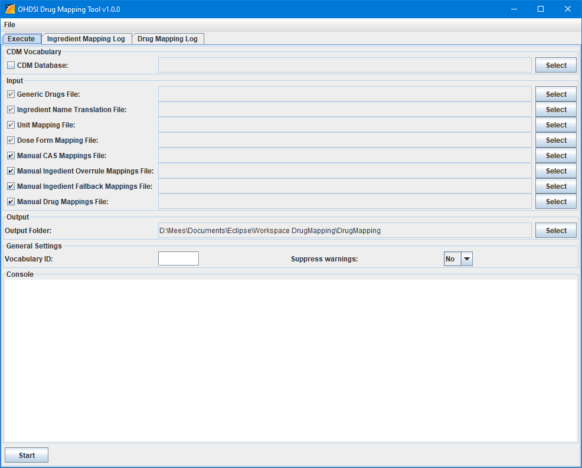
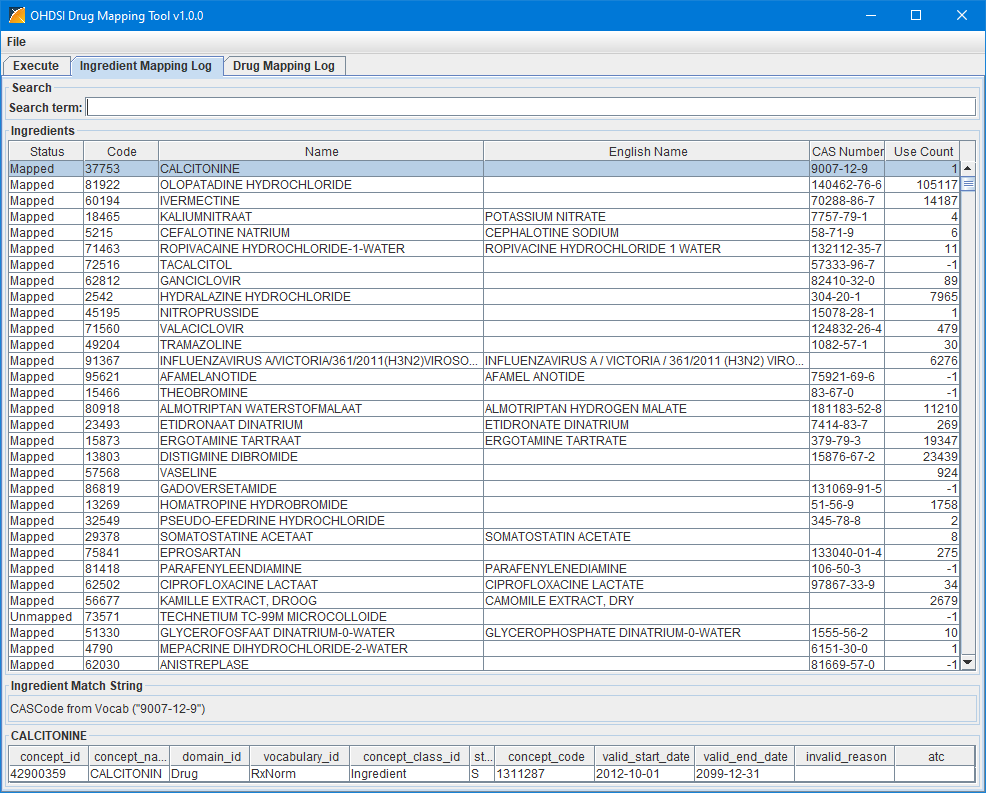
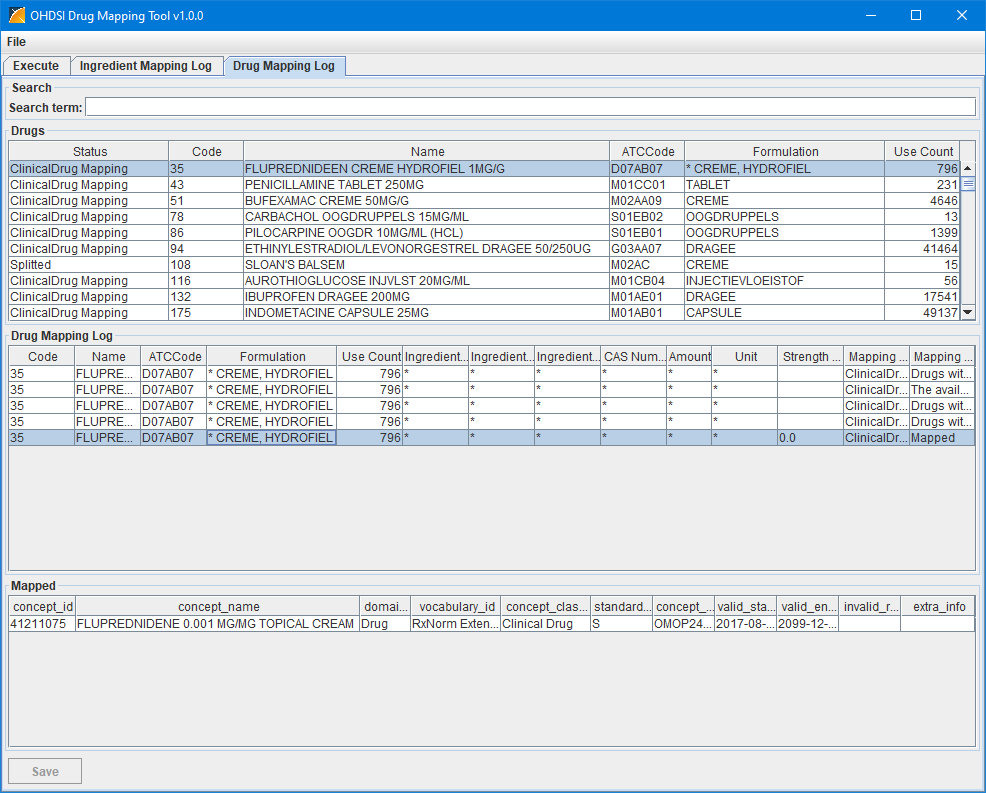
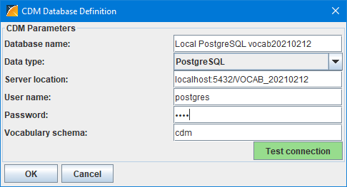
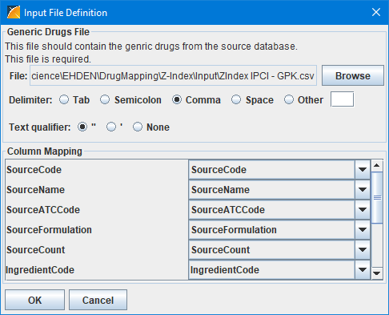

Introduction
========

The DrugMapping tool can create a drug mapping from the drugs and ingredients in your source database to the RxNorm drugs and ingredients in the OMOP CDM vocabulary.

Features
========

* Creates a mapping of source drugs and ingredients to RxNorm drugs and ingredients.
* Allows you to overrule the automatic mappings.
* Allows you to specify mappings for drugs that are not mapped.

Screenshots
===========

_The Execute tab._
  

_The Ingredient Mapping Log tab._
  

_The Drug Mapping Log tab._
  

_The CDM Database Definition Screen._
  

_The Input File Definition Screen._
  

Technology
============
DrugMapping is a pure Java application that uses JDBC to connect to the respective databases containing the standardized vocabulary

Getting Started
===============

Make sure you have a database containing the CDM vocabularies. The DrugMapping tool supports Oracle, PostgreSQL, and SQL Server.

The DrugMapping tool consists of two files released in a .zip file:

DrugMapping-vx.x.x.dat
DrugMapping-vx.x.x.jar

where x.x.x is the version number. Extract the zip file.

Start the the DrugMapping tool by double clicking the .jar file.

First you have to define the CDM database connection. To do this click on the &quot;Select&quot; button in the &quot;CDM Database&quot; box. This opens the Database Definition screen show above. The specification of the fields for the different databases are:

Oracle:

| **Field** | **Description** |
| ------------------------ | ----------------------------------------------------------------------------- |
| Database name | The name used for this connection |
| Data type | Oracle |
| Server location | \<server name/IP-address\>[\:\<port\>]/\<SID\> |
| User name | The user used to connect to the database. This user should have the right to create and remove a schema/user. |
| Password | The password of the user. This password will also be used for the CDM and Results schama's/users. |
| Vocabulary Schema | The name of the schema/user that will holds the CDM vocabulary tables. |

PostgreSQL:

| **Field** | **Description** |
| ------------------------ | ----------------------------------------------------------------------------- |
| Database name | The name used for this connection |
| Data type | PostgreSQL |
| Server location | \<server name/IP-address\>[\:\<port\>]/\<database name\> |
| User name | The user used to connect to the database. This user should have the right to create and remove a schema. |
| Password | The password of the user. |
| Vocabulary Schema | The name of the schema/user that will holds the CDM vocabulary tables. |

SQL Server:

| **Field** | **Description** |
| ------------------------ | ----------------------------------------------------------------------------- |
| Database name | The name used for this connection |
| Data type | SQL Server |
| Server location | \<server name/IP-address\>[\:\<port\>];database=\<database name\>; |
| User name | The user used to connect to the database. |
| Password | The password of the user. |
| Vocabulary Schema | The name of the schema/user that will holds the CDM vocabulary tables. |

Once defined, you can save this definition to a file using the menu option File-Save Database Settings. In another run you can load these settings again with the menu option File-Load Database Settings.
At the first run the tool will build a cache with all the information retrieved from the database in the subfolder "CDM Cache". At the following runs with the same "Database name" it will read the information from the files in the cache folder instead of from the database. In case the contents of the vocabularies in the database has changed you can select the check box left of the label "CDM Database" to force the tool to refresh the cache.

Second you have to specify the input files:

_Generic Drugs File_

This file is required and should contain the drugs of the source database.

| **Column Name** | **Contents** |
| --- | --- |
| SourceCode | The code of the source drug. |
| SourceName | The original name of the source drug. |
| SourceATCCode | The ATC code if available. |
| SourceFormulation | The formulation of the source drug. |
| SourceCount | The number of records in the database containing the source drug. |
| IngredientCode | The original code of an active ingredient of the source drug. |
| IngredientName | The original name of the ingredient of the source drug. |
| IngredientNameEnglish | The English name of the ingredient of the source drug. This can also be specified in the Ingredient Name Translation file described later. |
| Dosage | The dosage of the ingredient in the source drug. |
| DosageUnit | The unit of the dosage of the ingredient in the source drug. |
| CASNumber | The CAS-number of the ingredient if available. |

When a source drug has several active ingredients this file should contain a record for each ingredient, repeating the SourceCode, SourceName, SourceATCCode, SourceFormulation, and SourceCount values.

The DosageUnit may also contain units like mg/ml.

_Ingredient Name Translation File_

| **Column Name** | **Contents** |
| --- | --- |
| IngredientName | The source ingredient name |
| IngredientNameEnglish | The source ingredient name translated to English. |

_Unit Mapping File_

| **Column Name** | **Contents** |
| --- | --- |
| SourceUnit | The source unit (combination). |
| DrugCount | Number of drugs the unit is used in. |
| RecordCount | The number of data records the unit is used in. |
| Factor | The multiplication factor where SourceUnit \* Factor = TargeUnit. |
| TargetUnit | The target unit (combination) from CDM in terms of concept\_code. |
| Comment | Comments |

_Dose Form Mapping File_

| **Column Name** | **Contents** |
| --- | --- |
| DoseForm | The source dose form |
| Priority | Any whole number specifying the order the dose forms are used to map the drugs. Lower number comes first. |
| ConceptId | The concept\_id of the CDM dose form the source dose form is mapped to. |
| ConceptName | The concept\_name of the CDM dose form the source dose form is mapped to. |
| Comments | Comments |

_Manual CAS Mappings File_

This file should contain mappings of CAS numbers to CDM Ingredient concepts that overrule the automatic CAS mapping.

This file is optional.

| **Column** | **Content** |
| --- | --- |
| CASNumber | This is the CAS number of the substance. |
| concept\_id | This is the CDM concept id of the ingredient the CAS number should be mapped to. |
| concept\_name | This is the CDM concept name of the ingredient the CAS number should be mapped to. |

_Manual Ingedient Overrule Mappings File_

This file should contain manual mappings of source ingredients to CDM Ingredient concepts to overrule the automatic mapping because it is wrong.

This file is optional.

| **Column** | **Content** |
| --- | --- |
| SourceId | This is the id of the source ingredient. When empty ingredients starting with the SourceName are mapped. |
| SourceName | This is the name of the ingredient in the native language. |
| concept\_id | This is the CDM concept id of the ingredient the ingredient should be mapped to. |
| concept\_name | This is the CDM concept name of the ingredient the ingredient should be mapped to. |
| Comment | Comment on the mapping. |

_Manual Ingedient Fallback Mappings File_

This file should contain manual mappings of source ingredients to CDM Ingredient concepts in case they are not automatically mapped.

This file is optional.

| **Column** | **Content** |
| --- | --- |
| SourceId | This is the id of the source ingredient. When empty ingredients starting with the SourceName are mapped. |
| SourceName | This is the name of the ingredient in the native language. |
| concept\_id | This is the CDM concept id of the ingredient the ingredient should be mapped to. |
| concept\_name | This is the CDM concept name of the ingredient the ingredient should be mapped to. |
| Comment | Comment on the mapping. |

_Manual Drug Mappings File_

This file should contain manual mappings from source drugs to clinical drugs, clinical drug comps, or clinical drug forms that overrule the automated mapping.

This file is optional.

| **Column** | **Content** |
| --- | --- |
| SourceId | This is the code of the source drug. |
| concept\_id | This is the CDM concept id of the clinical drug, clinical drug comp, or clinical drug form the source drug should be mapped to. |

Finally you can specify an output folder where all the output files should be written.
As with the database settings you can save the file settings using the File-Save File Settings for later use. In another run you can load these settings again with the menu option File-Load File Settings.

The next section in the Execute tab is the "General Settings" section. It contains a field to enter the Vocabulary ID of the source vocabulary and a drop down box where you can specify if you to suppress warnings.
These settings can also be saved using the File-Save General Settings and loaded in another run with File-Load General Settings.

For the first run only the Generic Drugs File is required. Leave all check boxes of the manual mapping files unchecked. In this first run it will collect ingredient names, units and formulations from the source drug file and then it stops after creating a translation file for the ingredient names and empty mapping files for the units and formulations.

After you have specified the initial ingredient name translations and unit and formulation mappings you are ready to perform the first real mapping. For later runs you can adjust the mapping with the manual mapping files.

**The Result Files**

The tool creates several output files

_DrugMapping Log.txt_

This is the log file containing console output of the DrugMapping tool.

_IngredientMapping Mapping Log.csv_

This file contains information on how source ingredients are mapped to RxNorm (Extension) ingredients. It contains the following columns:

| **Column** | **Content** |
| --- | --- |
| IngredientCode | The code of the source ingredient. |
| IngredientName | The original name of the source ingredient. |
| IngredientNameEnglish | The English name of the source ingredient. |
| CASNumber | The CAS-number of the ingredient if available. |
| MatchString | The way the source ingredient is matched with the RxNorm (Extension) ingredient. |
| SourceCount | The number of records in the database containing the source ingredient. |
| concept\_id | The concept\_id of the RxNorm (Extension) ingredient. |
| concept\_name | The concept\_name of RxNorm (Extension) ingredient. |
| domain\_id | The domain\_id of RxNorm (Extension) ingredient. |
| vocabulary\_id | The vocabulary\_id of RxNorm (Extension) ingredient. |
| concept\_class\_id | The concept\_class of RxNorm (Extension) ingredient. |
| standard\_concept | The standard\_concept of RxNorm (Extension) ingredient. |
| concept\_code | The concept\_code of RxNorm (Extension) ingredient. |
| valid\_start\_date | The valid\_start\_date of RxNorm (Extension) ingredient. |
| valid\_end\_date | The valid\_end\_date of RxNorm (Extension) ingredient. |
| invalid\_reason | The invalid\_reason of RxNorm (Extension) ingredient. |
| ATC | The ATC code of the source ingredient if available. |

The file is sorted descending on the SourceCount column.

_DrugMapping Mapping Log.csv_

This file contains information on how the source drugs are mapped to the RxNorm (Extension) drugs. It contains the following columns:

| **Column** | **Content** |
| --- | --- |
| MappingStatus | ClinicalDrug Mapping = The drug is mapped to a Clinical Drug. ClinicalDrugForm Mapping = The drug is mapped to a Clinical Drug Form. ClinicalDrugComp Mapping = The drug is mapped to a Clinical Drug Comp. Ingredient Mapping = All ingredients of the drug are mapped to an Ingredient. Incomplete Mapping = Not all ingredients of the drug are mapped to an Ingredient. Splitted = Ingredients are mapped to either Clinical Drug Comp or Ingredient. Unmapped = No mapping could be made. |
| SourceCode | The code of the source drug. |
| SourceName | The original name of the source drug. |
| SourceATCCode | The ATC code if available. |
| SourceFormulation | The formulation of the source drug. |
| SourceCount | The number of records in the database containing the source drug. |
| _The following columns are filled with a \* when the source drug is mapped or with the specified content when the source drug could not be mapped but its ingredients could be mapped. In that case the file contains a line for each of the ingredients._ |
| IngredientCode | The code of the source ingredient |
| IngredientName | The original name of an active ingredient of the source drug. |
| IngredientNameEnglish | The English name of the ingredient. |
| CASNumber | The CAS-number of the ingredient. |
| SourceIngredientAmount | The source amount of the source ingredient. |
| SourceIngredientUnit | The source unit of the source ingredient. |
| StrengthMarginPercentage | The percentage the source strength deviates from the matched strength. |
| The following two columns contain information about the mapping steps. |
| MappingType | The mapping that is attempted. |
| MappingResult | The (intermediate) result of the attempted mapping. |
| Concept1 | This column and the following columns contain concepts that are involved in this mapping result.|
| ''' ||
| ConceptN | |

The file is sorted descending on the SourceCount column.

_DrugMapping.csv_

This file contains drug mapping. It contains the following columns:

| **Column** | **Content** |
| --- | --- |
| MappingStatus | ClinicalDrug Mapping = The drug is mapped to a Clinical Drug. ClinicalDrugForm Mapping = The drug is mapped to a Clinical Drug Form. ClinicalDrugComp Mapping = The drug is mapped to a Clinical Drug Comp. Ingredient Mapping = All ingredients of the drug are mapped to an Ingredient. Incomplete Mapping = Not all ingredients of the drug are mapped to an Ingredient. Splitted = Ingredients are mapped to either Clinical Drug Comp or Ingredient. Unmapped = No mapping could be made. |
| SourceCode | The code of the source drug. |
| SourceName | The original name of the source drug. |
| SourceATCCode | The ATC code if available. |
| SourceFormulation | The formulation of the source drug. |
| SourceCount | The number of records in the database containing the source drug. |
| _The following columns are filled with a \* when the source drug is mapped or with the specified content when the source drug could not be mapped but its ingredients could be mapped. In that case the file contains a line for each of the ingredients._ |
| IngredientCode | The code of the source ingredient |
| IngredientName | The original name of an active ingredient of the source drug. |
| IngredientNameEnglish | The English name of the ingredient. |
| CASNumber | The CAS-number of the ingredient. |
| SourceIngredientAmount | The source amount of the source ingredient. |
| SourceIngredientUnit | The source unit of the source ingredient. |
| StrengthMarginPercentage | The percentage the source strength deviates from the matched strength. |
| MappingType | ClinicalDrug Mapping = The drug is mapped to a Clinical Drug. ClinicalDrugForm Mapping = The drug is mapped to a Clinical Drug Form. ClinicalDrugComp Mapping = The drug is mapped to a Clinical Drug Comp. Ingredient Mapping = All ingredients of the drug are mapped to an Ingredient. Splitted = Ingredients are mapped to either Clinical Drug Comp or Ingredient. &lt;Blank&gt; = No mapping could be made. |
| concept\_id | The concept\_id of the RxNorm (Extension) drug or ingredient. |
| concept\_name | The concept\_name of RxNorm (Extension) drug or ingredient. |
| domain\_id | The domain\_id of RxNorm (Extension) drug or ingredient. |
| vocabulary\_id | The vocabulary\_id of RxNorm (Extension) drug or ingredient. |
| concept\_class\_id | The concept\_class of RxNorm (Extension) drug or ingredient. |
| standard\_concept | The standard\_concept of RxNorm (Extension) drug or ingredient. |
| concept\_code | The concept\_code of RxNorm (Extension) drug or ingredient. |
| valid\_start\_date | The valid\_start\_date of RxNorm (Extension) drug or ingredient. |
| valid\_end\_date | The valid\_end\_date of RxNorm (Extension) drug or ingredient. |
| invalid\_reason | The invalid\_reason of RxNorm (Extension) drug or ingredient. |

_SourceToConceptMap.csv_

This file contains the source to concept map. It contains the following columns:

| **Column** | **Content** |
| --- | --- |
| source_code | "Drug " followed by the source drug code or "Ingredient " followed by the source ingredient code. |
| source_concept_id | This value is set to 0 but should be replaced by a valid concept_id. |
| source_vocabulary_id | The value of the "Vocabulary ID" field from the general settings. |
| source_code_description | The source drug name or source ingredient name. |
| target_concept_id | The concept\_id of the RxNorm (Extension) drug or ingredient. |
| target_vocabulary_id | The vocabulary\_id of RxNorm (Extension) drug or ingredient. |
| valid_start_date | The valid\_start\_date of RxNorm (Extension) drug or ingredient. |
| valid_end_date | The valid\_end\_date of RxNorm (Extension) drug or ingredient. |
| invalid_reason | The invalid\_reason of RxNorm (Extension) drug or ingredient. |

_DrugMapping Missing ATC.csv_

This file contains the source that don't have an ATC code. It contains the following columns:

| **Column** | **Content** |
| --- | --- |
| SourceCode | The code of the source drug. |
| SourceName | The original name of the source drug. |
| SourceATCCode |  |
| SourceFormulation | The formulation of the source drug. |
| SourceCount | The number of records in the database containing the source drug. |

**Command Line Options**

The DrugMapping tool can also be started from the command line with the command:

java -jar &lt;DrugMapping-vx.x.x.jar file&gt; &#91;databasesettings=&lt;database settings file&gt; password=&lt;database password&gt;&#93; &#91;filesettings=&lt;file settings file&gt;&#93; &#91;generalsettings=&lt;general settings file&gt;&#93; &#91;path=&lt;path where result files are written&gt;&#93; &#91;autostart=yes&#93;

[...] means the option is optional. The square brackets should not be written in the command.

Getting Involved
=============
* We use the [GitHub issue tracker](../../issues) for all bugs/issues/enhancements/questions
* Historically, all files have CRLF line endings. Please configure your IDE and local git to keep line endings as is. This avoids merge conflicts.

License
=======
DrugMapping is licensed under Apache License 2.0
