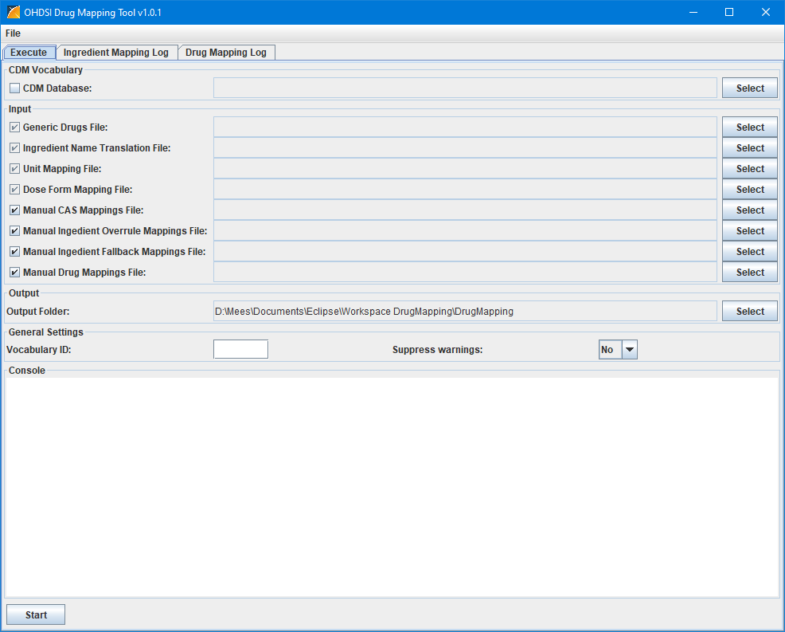
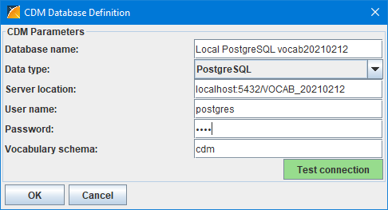
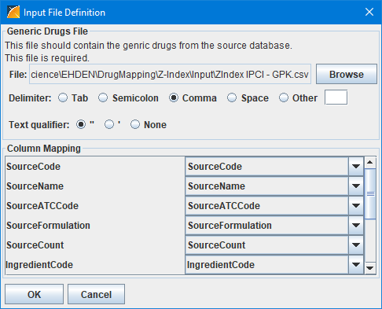
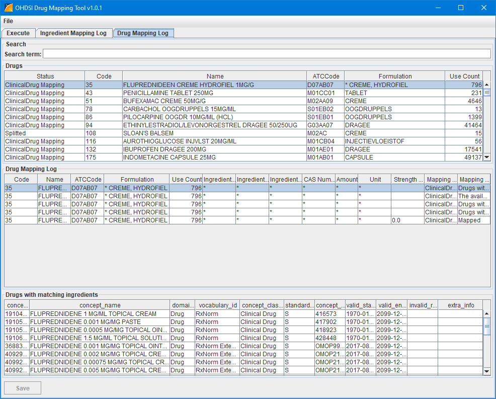
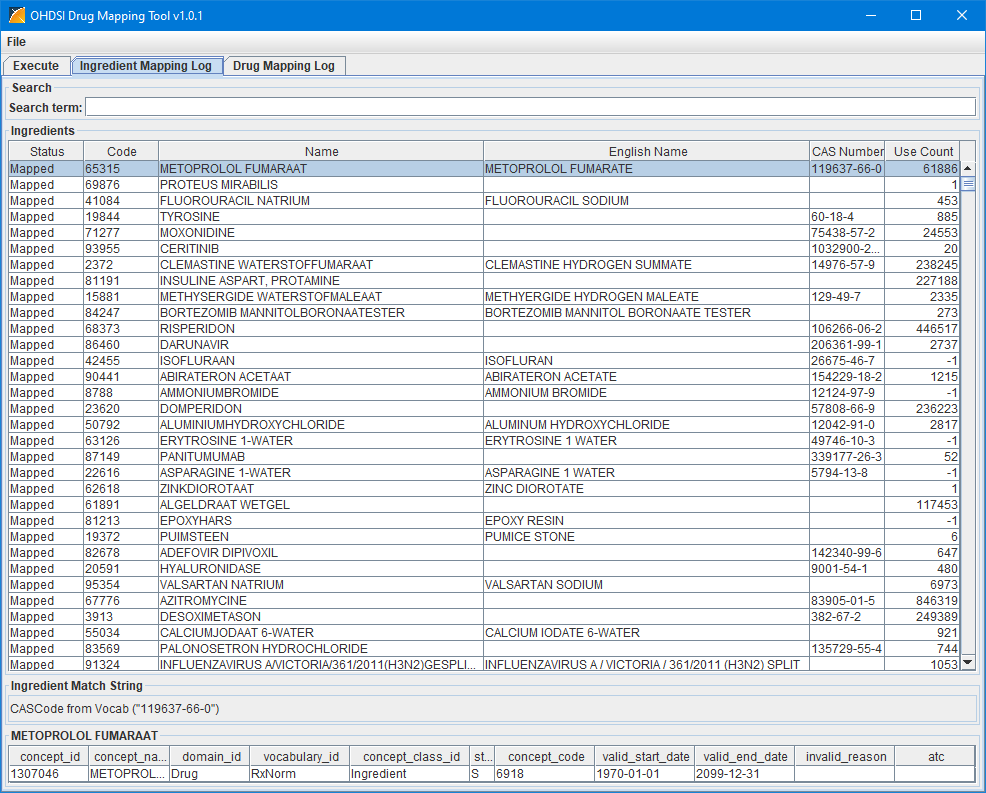

Introduction
========

The DrugMapping tool can create a drug mapping from the drugs and ingredients in your source database to the RxNorm drugs and ingredients in the OMOP CDM vocabulary.

Features
========

* Creates a mapping of source drugs and ingredients to RxNorm drugs and ingredients.
* Allows you to overrule the automatic mappings.
* Allows you to specify mappings for drugs that are not mapped.

Technology
============
DrugMapping is a pure Java application that uses JDBC to connect to the respective databases containing the standardized vocabulary.

Prerequisites
=============
Make sure you have a database containing the CDM vocabularies. The DrugMapping tool supports Oracle, PostgreSQL, and SQL Server.

Getting Started
===============
The DrugMapping tool consists of two files released in a .zip file:

DrugMapping-vx.x.x.dat 
DrugMapping-vx.x.x.jar

where x.x.x is the version number. Extract the zip file.

Start the the DrugMapping tool by double clicking the .jar file.
The interface of the DrugMapping tool consists of three tabs:

Execute 
Ingredient Mapping Log 
Drug Mapping Log

It opens with the Execute tab shown here:

_The Execute tab._
  

First you have to define the CDM database connection. To do this click on the &quot;Select&quot; button in the &quot;CDM Vocabulary&quot; box. This opens the Database Definition screen shown here:

_The CDM Database Definition screen._
  

The specification of the fields for the different databases are:

Oracle:

| **Field** | **Description** |
| ------------------------ | ----------------------------------------------------------------------------- |
| Database name | The name used for this connection |
| Data type | Oracle |
| Server location | \<server name/IP-address\>[\:\<port\>]/\<SID\> |
| User name | The user used to connect to the database. This user should have the right to create and remove a schema/user. |
| Password | The password of the user. This password will also be used for the CDM and Results schama's/users. |
| Vocabulary Schema | The name of the schema/user that will holds the CDM vocabulary tables. |

PostgreSQL:

| **Field** | **Description** |
| ------------------------ | ----------------------------------------------------------------------------- |
| Database name | The name used for this connection |
| Data type | PostgreSQL |
| Server location | \<server name/IP-address\>[\:\<port\>]/\<database name\> |
| User name | The user used to connect to the database. This user should have the right to create and remove a schema. |
| Password | The password of the user. |
| Vocabulary Schema | The name of the schema/user that will holds the CDM vocabulary tables. |

SQL Server:

| **Field** | **Description** |
| ------------------------ | ----------------------------------------------------------------------------- |
| Database name | The name used for this connection |
| Data type | SQL Server |
| Server location | \<server name/IP-address\>[\:\<port\>];database=\<database name\>; |
| User name | The user used to connect to the database. |
| Password | The password of the user. |
| Vocabulary Schema | The name of the schema/user that will holds the CDM vocabulary tables. |

You can test the database connection with the Test connection" button.
Once defined, you can save this definition to a file using the menu option "Save Database Settings" from the "File menu. In another run you can load these settings again with the option "Load Database Settings" from the "File menu. 
At the first use of a database the DrugMapping tool will build a cache with all the information retrieved from the database in the subfolder "CDM Cache". At the following runs with the same "Database name" it will read the information from the files in the cache folder instead of from the database. In case the contents of the vocabularies in the database has changed you can select the check box left of the label "CDM Database" to force the tool to refresh the cache. 
When you load the database settings saved earlier the "CDM Database Definition" screen will open to allow you to enter the password for the database and test the connection. The password is not saved with the database settings

The next thing to do is specify the input files:

Generic Drugs File 
Ingredient Name Translation File
Unit Mapping File
Dose Form Mapping File
Manual CAS Mappings File
Manual Ingredient Overrule Mappings File
Manual Ingredient Fallback Mappings File
Manual Drug Mappings File

In the section "The input Files" below you will find a description of each of these input files. All these files are delimited files. 
At the first run you only have to specify the "Generic Drugs File". With this first run it will create empty versions of the "Ingredient Name Translation File", "Unit Mapping File" and the "Dose Form Mapping File" in the output folder specified also in this tab. After the first run you have to complete these files first and use them in the following runs.
You can specify a file by clicking on the Select button behind it. This will open the "Input File Definition Screen" shown here:

_The Input File Definition screen._
  

In this screen you first select the file with the "Browse" button. As soon as you have specified the right delimiter and text qualifier the columns of the file will be shown in the drop-down boxes at the right side of the "Column Mapping" box in this screen. At the left side of this box you see all the required columns for the input file which you can map to the columns of the actual input file by selecting the right column in the drop-down box behind it. When done click OK. 
Before you start the run make sure the check boxes left of the files you want to use are checked. 
Once all input files are specified you can save the settings with the "Save File Settings" option from the "File" menu for future runs where you can load them again with the "Load File Settings" option from the "File" menu. The setting of the check boxes are also saved with the file settings.

Next you have to specify an output folder where all the output files should be written.
The setting of the output folder is saved together with the other file settings using the "Save File Settings" from the "File" menu.

Finally you have to specify the Vocabulary ID of your source vocabulary that can be used in the source_to_concept_map table of the OMOP CDM and a setting if you want to see warnings or not.
These settings can also be saved using the "Save General Settings" option from the "File" menu and loaded in another run with "Load General Settings" option from the "File" menu.

There is also a console box in the tab where you can follow the progress of the mapping. 
Once all settings are done you can start the mapping with the Start button at the left bottom.

When the mapping is done the tool automatically switches to the "Drug Mapping Log" tab while it is still saving the mapping and the log file to the output folder. 
The "Drug Mapping Log" tab shows the steps for the mapping for each source drug. It is shown here:

_The Drug Mapping Log tab._
  

This tab consists of four sections. 
At the top is the Search section with a field where you can enter a search term. While typing in this field it will select the lines in the Drugs section that contain the search term. 
The Drugs section contains all source drugs. By clicking on one of the column headers you can sort the drugs. When you select one it will show the different steps in in the mapping for this drug are shown in the "Drug Mapping Log" section. The right most column "Mapping Result" shows the step in the mapping process chronologically show from top to bottom. 
When you select a line in the "Drug Mapping Log" section the CDM concepts involved are shown in the bottom section.

The "Ingredient Mapping Log" tab shows the results of mapping the ingredients of the source drug to CDM Ingredient concepts. It is show here:

_The Ingredient Mapping Log tab._
  

At the top is the Search section with a field where you can enter a search term. While typing in this field it will select the lines in the Ingredients section that contain the search term. 
The Ingredients section contains all ingredients of the source drugs. By clicking on one of the column headers you can sort the ingredients. When you select one it will show how it is mapped to a CDM Ingredient and in the bottom section it will show the Ingredient concept it is mapped to.

When you have the results of a run you can reload them in the tool with the option "load Mapping Results" from the "File" menu. With option you will get a window to select the "DrugMapping Log.txt" file of the result you want to load. After loading you can view them again in the "Ingredient Mapping Log" tab and the "Drug Mapping Log" tab.

The Input Files
===============
Below you will find a description of each of the input files.

_Generic Drugs File_

This file is required and should contain the drugs of the source database.

| **Column Name** | **Contents** |
| --- | --- |
| SourceCode | The code of the source drug. |
| SourceName | The original name of the source drug. |
| SourceATCCode | The ATC code if available. |
| SourceFormulation | The formulation of the source drug. |
| SourceCount | The number of records in the database containing the source drug. |
| IngredientCode | The original code of an active ingredient of the source drug. |
| IngredientName | The original name of the ingredient of the source drug. |
| IngredientNameEnglish | The English name of the ingredient of the source drug. This can also be specified in the Ingredient Name Translation file described later. |
| Dosage | The dosage of the ingredient in the source drug. |
| DosageUnit | The unit of the dosage of the ingredient in the source drug. |
| CASNumber | The CAS-number of the ingredient if available. |

When a source drug has several active ingredients this file should contain a record for each ingredient, repeating the SourceCode, SourceName, SourceATCCode, SourceFormulation, and SourceCount values.

The DosageUnit may also contain units like mg/ml.

_Ingredient Name Translation File_

| **Column Name** | **Contents** |
| --- | --- |
| IngredientName | The source ingredient name |
| IngredientNameEnglish | The source ingredient name translated to English. |

_Unit Mapping File_

| **Column Name** | **Contents** |
| --- | --- |
| SourceUnit | The source unit (combination). |
| DrugCount | Number of drugs the unit is used in. |
| RecordCount | The number of data records the unit is used in. |
| Factor | The multiplication factor where SourceUnit \* Factor = TargeUnit. |
| TargetUnit | The target unit (combination) from CDM in terms of concept\_code. |
| Comment | Comments |

_Dose Form Mapping File_

| **Column Name** | **Contents** |
| --- | --- |
| DoseForm | The source dose form |
| Priority | Any whole number specifying the order the dose forms are used to map the drugs. Lower number comes first. |
| ConceptId | The concept\_id of the CDM dose form the source dose form is mapped to. |
| ConceptName | The concept\_name of the CDM dose form the source dose form is mapped to. |
| Comments | Comments |

_Manual CAS Mappings File_

This file should contain mappings of CAS numbers to CDM Ingredient concepts that overrule the automatic CAS mapping.

This file is optional.

| **Column** | **Contents** |
| --- | --- |
| CASNumber | This is the CAS number of the substance. |
| concept\_id | This is the CDM concept id of the ingredient the CAS number should be mapped to. |
| concept\_name | This is the CDM concept name of the ingredient the CAS number should be mapped to. |

_Manual Ingedient Overrule Mappings File_

This file should contain manual mappings of source ingredients to CDM Ingredient concepts to overrule the automatic mapping because it is wrong.

This file is optional.

| **Column** | **Contents** |
| --- | --- |
| SourceId | This is the id of the source ingredient. When empty ingredients starting with the SourceName are mapped. |
| SourceName | This is the name of the ingredient in the native language. |
| concept\_id | This is the CDM concept id of the ingredient the ingredient should be mapped to. |
| concept\_name | This is the CDM concept name of the ingredient the ingredient should be mapped to. |
| Comment | Comment on the mapping. |

_Manual Ingedient Fallback Mappings File_

This file should contain manual mappings of source ingredients to CDM Ingredient concepts in case they are not automatically mapped.

This file is optional.

| **Column** | **Contents** |
| --- | --- |
| SourceId | This is the id of the source ingredient. When empty ingredients starting with the SourceName are mapped. |
| SourceName | This is the name of the ingredient in the native language. |
| concept\_id | This is the CDM concept id of the ingredient the ingredient should be mapped to. |
| concept\_name | This is the CDM concept name of the ingredient the ingredient should be mapped to. |
| Comment | Comment on the mapping. |

_Manual Drug Mappings File_

This file should contain manual mappings from source drugs to clinical drugs, clinical drug comps, or clinical drug forms that overrule the automated mapping.

This file is optional.

| **Column** | **Contents** |
| --- | --- |
| SourceId | This is the code of the source drug. |
| concept\_id | This is the CDM concept id of the clinical drug, clinical drug comp, or clinical drug form the source drug should be mapped to. |

Examples of the input files can be found <a href="example" target="_blank">here</a>.

The Result Files
================
The tool creates several output files. They are described here.

_DrugMapping Log.txt_

This is the log file containing console output of the DrugMapping tool.

_IngredientMapping Mapping Log.csv_

This file contains information on how source ingredients are mapped to RxNorm (Extension) ingredients. It contains the following columns:

| **Column** | **Contents** |
| --- | --- |
| IngredientCode | The code of the source ingredient. |
| IngredientName | The original name of the source ingredient. |
| IngredientNameEnglish | The English name of the source ingredient. |
| CASNumber | The CAS-number of the ingredient if available. |
| MatchString | The way the source ingredient is matched with the RxNorm (Extension) ingredient. |
| SourceCount | The number of records in the database containing the source ingredient. |
| concept\_id | The concept\_id of the RxNorm (Extension) ingredient. |
| concept\_name | The concept\_name of RxNorm (Extension) ingredient. |
| domain\_id | The domain\_id of RxNorm (Extension) ingredient. |
| vocabulary\_id | The vocabulary\_id of RxNorm (Extension) ingredient. |
| concept\_class\_id | The concept\_class of RxNorm (Extension) ingredient. |
| standard\_concept | The standard\_concept of RxNorm (Extension) ingredient. |
| concept\_code | The concept\_code of RxNorm (Extension) ingredient. |
| valid\_start\_date | The valid\_start\_date of RxNorm (Extension) ingredient. |
| valid\_end\_date | The valid\_end\_date of RxNorm (Extension) ingredient. |
| invalid\_reason | The invalid\_reason of RxNorm (Extension) ingredient. |
| ATC | The ATC code of the source ingredient if available. |

The file is sorted descending on the SourceCount column.

_DrugMapping Mapping Log.csv_

This file contains information on how the source drugs are mapped to the RxNorm (Extension) drugs. It contains the following columns:

| **Column** | **Contents** |
| --- | --- |
| MappingStatus | ClinicalDrug Mapping = The drug is mapped to a Clinical Drug. ClinicalDrugForm Mapping = The drug is mapped to a Clinical Drug Form. ClinicalDrugComp Mapping = The drug is mapped to a Clinical Drug Comp. Ingredient Mapping = All ingredients of the drug are mapped to an Ingredient. Incomplete Mapping = Not all ingredients of the drug are mapped to an Ingredient. Splitted = Ingredients are mapped to either Clinical Drug Comp or Ingredient. Unmapped = No mapping could be made. |
| SourceCode | The code of the source drug. |
| SourceName | The original name of the source drug. |
| SourceATCCode | The ATC code if available. |
| SourceFormulation | The formulation of the source drug. |
| SourceCount | The number of records in the database containing the source drug. |
| IngredientCode | The code of the source ingredient or * when the source drug is mapped to a Clinical Drug, Clinical Drug Form or Clinical Drug Comp. |
| IngredientName | The original name of an active ingredient of the source drug or * when the source drug is mapped to a Clinical Drug, Clinical Drug Form or Clinical Drug Comp. |
| IngredientNameEnglish | The English name of the ingredient or * when the source drug is mapped to a Clinical Drug, Clinical Drug Form or Clinical Drug Comp. |
| CASNumber | The CAS-number of the ingredient or * when the source drug is mapped to a Clinical Drug, Clinical Drug Form or Clinical Drug Comp. |
| SourceIngredientAmount | The source amount of the source ingredient or * when the source drug is mapped to a Clinical Drug, Clinical Drug Form or Clinical Drug Comp. |
| SourceIngredientUnit | The source unit of the source ingredient or * when the source drug is mapped to a Clinical Drug, Clinical Drug Form or Clinical Drug Comp. |
| StrengthMarginPercentage | The percentage the source strength deviates from the matched strength. |
| The following two columns contain information about the mapping steps. |
| MappingType | The mapping that is attempted. |
| MappingResult | The (intermediate) result of the attempted mapping. |
| Concept1 | This column and the following columns contain concepts that are involved in this mapping result.|
| ''' ||
| ConceptN | |

The file is sorted descending on the SourceCount column.

_DrugMapping.csv_

This file contains drug mapping. It contains the following columns:

| **Column** | **Contents** |
| --- | --- |
| MappingStatus | ClinicalDrug Mapping = The drug is mapped to a Clinical Drug. ClinicalDrugForm Mapping = The drug is mapped to a Clinical Drug Form. ClinicalDrugComp Mapping = The drug is mapped to a Clinical Drug Comp. Ingredient Mapping = All ingredients of the drug are mapped to an Ingredient. Incomplete Mapping = Not all ingredients of the drug are mapped to an Ingredient. Splitted = Ingredients are mapped to either Clinical Drug Comp or Ingredient. Unmapped = No mapping could be made. |
| SourceCode | The code of the source drug. |
| SourceName | The original name of the source drug. |
| SourceATCCode | The ATC code if available. |
| SourceFormulation | The formulation of the source drug. |
| SourceCount | The number of records in the database containing the source drug. |
| IngredientCode | The code of the source ingredient or * when the source drug is mapped to a Clinical Drug, Clinical Drug Form or Clinical Drug Comp. |
| IngredientName | The original name of an active ingredient of the source drug or * when the source drug is mapped to a Clinical Drug, Clinical Drug Form or Clinical Drug Comp. |
| IngredientNameEnglish | The English name of the ingredient or * when the source drug is mapped to a Clinical Drug, Clinical Drug Form or Clinical Drug Comp. |
| CASNumber | The CAS-number of the ingredient or * when the source drug is mapped to a Clinical Drug, Clinical Drug Form or Clinical Drug Comp. |
| SourceIngredientAmount | The source amount of the source ingredient or * when the source drug is mapped to a Clinical Drug, Clinical Drug Form or Clinical Drug Comp. |
| SourceIngredientUnit | The source unit of the source ingredient or * when the source drug is mapped to a Clinical Drug, Clinical Drug Form or Clinical Drug Comp. |
| StrengthMarginPercentage | The percentage the source strength deviates from the matched strength. |
| MappingType | ClinicalDrug Mapping = The drug is mapped to a Clinical Drug. ClinicalDrugForm Mapping = The drug is mapped to a Clinical Drug Form. ClinicalDrugComp Mapping = The drug is mapped to a Clinical Drug Comp. Ingredient Mapping = All ingredients of the drug are mapped to an Ingredient. Splitted = Ingredients are mapped to either Clinical Drug Comp or Ingredient. &lt;Blank&gt; = No mapping could be made. |
| concept\_id | The concept\_id of the RxNorm (Extension) drug or ingredient. |
| concept\_name | The concept\_name of RxNorm (Extension) drug or ingredient. |
| domain\_id | The domain\_id of RxNorm (Extension) drug or ingredient. |
| vocabulary\_id | The vocabulary\_id of RxNorm (Extension) drug or ingredient. |
| concept\_class\_id | The concept\_class of RxNorm (Extension) drug or ingredient. |
| standard\_concept | The standard\_concept of RxNorm (Extension) drug or ingredient. |
| concept\_code | The concept\_code of RxNorm (Extension) drug or ingredient. |
| valid\_start\_date | The valid\_start\_date of RxNorm (Extension) drug or ingredient. |
| valid\_end\_date | The valid\_end\_date of RxNorm (Extension) drug or ingredient. |
| invalid\_reason | The invalid\_reason of RxNorm (Extension) drug or ingredient. |

_SourceToConceptMap.csv_

This file contains the source to concept map. It contains the following columns:

| **Column** | **Contents** |
| --- | --- |
| source_code | "Drug " followed by the source drug code or "Ingredient " followed by the source ingredient code. |
| source_concept_id | This value is set to 0 but should be replaced by a valid concept_id. |
| source_vocabulary_id | The value of the "Vocabulary ID" field from the general settings. |
| source_code_description | The source drug name or source ingredient name. |
| target_concept_id | The concept\_id of the RxNorm (Extension) drug or ingredient. |
| target_vocabulary_id | The vocabulary\_id of RxNorm (Extension) drug or ingredient. |
| valid_start_date | The valid\_start\_date of RxNorm (Extension) drug or ingredient. |
| valid_end_date | The valid\_end\_date of RxNorm (Extension) drug or ingredient. |
| invalid_reason | The invalid\_reason of RxNorm (Extension) drug or ingredient. |

Command Line Options
====================
The DrugMapping tool can also be started from the command line with the command:

java -jar &lt;DrugMapping-vx.x.x.jar file&gt; &#91;databasesettings=&lt;path of database settings file&gt; password=&lt;database password&gt;&#93; &#91;filesettings=&lt;path of file settings file&gt;&#93; &#91;generalsettings=&lt;path of general settings file&gt;&#93; &#91;autostart=yes&#93;

[...] means the option is optional. The square brackets should not be written in the command.

Getting Involved
================
* We use the [GitHub issue tracker](../../issues) for all bugs/issues/enhancements/questions
* Historically, all files have CRLF line endings. Please configure your IDE and local git to keep line endings as is. This avoids merge conflicts.

License
=======
DrugMapping is licensed under Apache License 2.0
